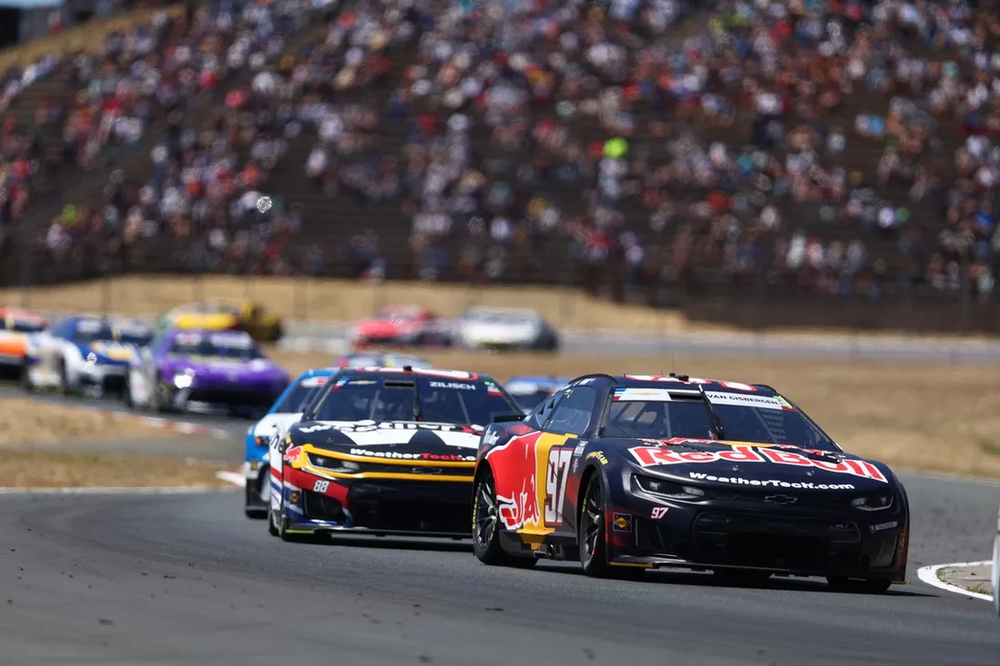
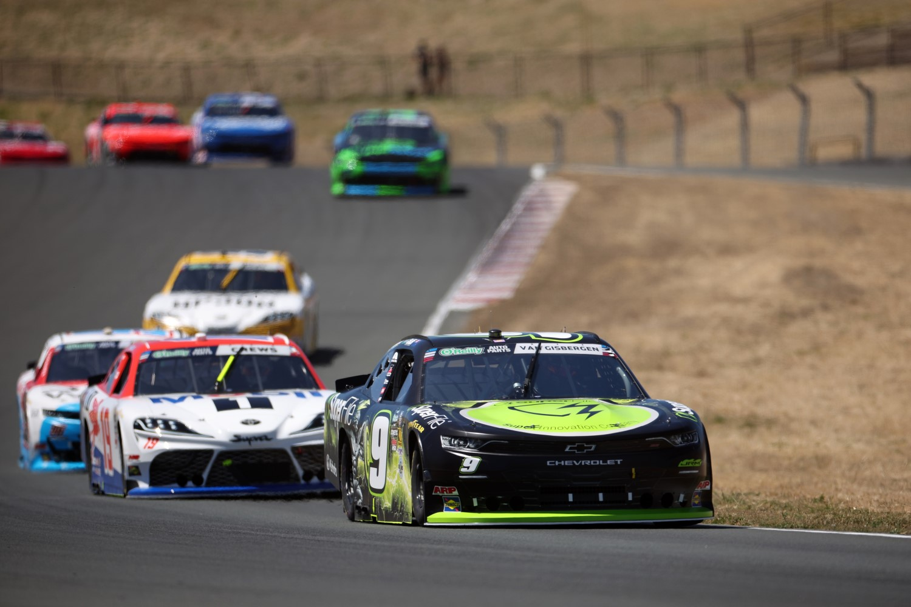
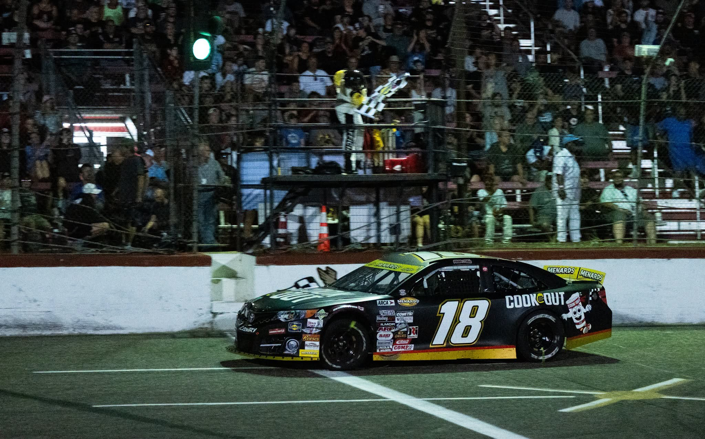

Thumbnail photo credit: Icon Sportswire via Getty Images

## Cup Series: Toyota / Save Mart 350

This past weekend, the Cup Series ran its final race of the first half of the 2026 season, and its fourth and final race on a non-oval circuit. Shane van Gisbergen held on to claim his second win of the season, but in much closer fashion than his earlier win at Watkins Glen. While SVG did lead a dominating 74 of the 110 laps, it looked like just one more lap was all that Chase Briscoe needed to get past him. SVG admittedly did not have the greatest car of his NASCAR career, but his generational road course talent was enough to hold off the superior Joe Gibbs Racing equipment and (somewhat) make up for getting wrecked while battling for the lead two weeks ago in San Diego.

Joe Gibbs Racing was definitely the fastest team this past weekend, flipping the script after a very disappointing outing in San Diego. In NASCAR's first trip to Naval Base Coronado, the highest finishing JGR driver was Denny Hamlin in 14th place. But in just one week's time JGR put together one of their best races of the season, with Chase Briscoe running down SVG in the closing laps to finish second, Ty Gibbs winning the pole and both stages en route to a third place finish, and Christopher Bell scoring 18 stage points and a much needed fifth place finish. As for Denny Hamlin, well, we'll get to him later. But anyway, that just goes to show road courses are not all the same as far as predicting the top performers.

Another key example of that was 23XI Racing, who after having all four of their cars in the top 6 with just 2 laps to go at San Diego, went the complete&mdash;and I mean complete&mdash;opposite direction at Sonoma. After crashing in qualifying and starting from the rear, Bubba Wallace was the best finishing driver from the 23XI camp in 22nd place, while their star driver this season and the points leader coming into Sonoma, Tyler Reddick, finished dead last after suffering power steering issues and losing six laps to make repairs. Reddick, who has now finished 25th or worse in three of the last four races and has seen his points lead being slowly eaten away by Denny Hamlin, was finally overtaken after Sonoma by a single point. 

It's been no secret that Denny Hamlin has struggled on the road courses in the NextGen car, and nowhere as much as Sonoma. Coming into this weekend, Hamlin's best Sonoma finish in the NextGen car was 20th, and after a race in which the first and second place drivers in points were running last and second-to-last at one time, Hamlin settled for a disappointing, but not unexpected, 26th place finish (no thanks to Carson Hocevar spinning him at the beginning of the final stage). Nevertheless, his scuffed race was enough to take the points lead from Tyler Reddick heading into NASCAR's return to Chicagoland this weekend; a track that will surely provide a breath of fresh air to Hamlin after back to back weeks on the road courses.

As far as other notable drivers and performances this past weekend, the rookie Connor Zilisch ran up front all day and reached as high as second place before fading to finish in seventh place. Despite showing top 10 speed at each of the three prior road course races this season, Zilisch has seemed to be cursed in the final stage, but this time he was finally able to score his first career top 10 finish. In my opinion, the only unexpected drivers to finish in the top 10 were Ryan Preece and Alex Bowman. Preece has quietly turned into a sleeper pick on the right turn tracks, as his eighth place finish extended his road course top 20 streak to nine straight races. Alex Bowman in tenth place was also a bit of a surprise given just how much the Hendrick 48 team has struggled this season. I might also throw in fifth-place-finishing Christopher Bell as a surprise, simply because his fractured left wrist forced him to do a driver swap just one week prior at San Diego.

The race itself mirrored the O'Reilly and ARCA West races earlier in the weekend in that there was very little chaos. The only caution besides the scheduled stage cautions came on lap 61 when Austin Cindric and Josh Berry got together, causing Berry to spin and forcing Noah Gragson and Bubba Wallace to slam the brakes to avoid hitting Berry. All four drivers avoided getting any race-impacting damage.

## O'Reilly Auto Parts Series: Pit Boss/FoodMaxx 250

<figure style="float: left; margin-left: 0px; margin-right: 30px; width: 300px;">
  
  <figcaption style="font-size: 1em; color: gray; text-align: center;">
    Credit: James Gilbert/Getty Images
  </figcaption>
</figure>

The O'Reilly race was one of the most calm ones in recent memory, which was definitely to the benefit of race winner Shane van Gisbergen. Picking up his second O'Reilly win of the year on Saturday before going on to win his second Cup race of the year on Sunday, SVG looked to be making a warmup session out of the O'Reilly race. His only real competition all race was his JR Motorsports teammate and fellow Cup leech Connor Zilisch, who had to start in the back after getting a flat tire in qualifying, and was left playing catch-up all day. Zilisch was closing the gap to SVG in the final laps, as van Gisbergen was in fuel saving mode for much of the third stage, but Zilisch never got within striking distance.

Besides the expected 1-2 finish by the JR Motorsports road course aces, the biggest story of the race was the top 5 speed from both Viking Motorsports cars. The Viking team, which purchased multiple cars from Kaulig Racing and entered an 'enhanced' technical alliance with Richard Childress Racing this past offseason, has been the most improved team of 2026 by far. Just last season they were a single car, 20th to 25th place team and now they are contending for a spot in the Chase with Parker Retzlaff, and are seeing flashes of greatness, especially in recent weeks, from Anthony Alfredo in their second car. This race at Sonoma was a showcase of Alfredo's improvement in particular as he won the first stage (albeit due to pit strategy) and charged back to finish in fourth place, followed by his teammate Retzlaff in fifth. Mind you, this is the same Anthony Alfredo and same Viking Motorsports 96 team that failed to qualify for the season opener at Daytona and only had one top 10 finish through the first 13 races.

Other drivers who ran better than anticipated this weekend, or at least much better than their team's average, include: Carson Kvapil, who powered the DGM Racing 91 car to its season-best finish of sixth place, Austin Green, who came from the back in a backup car to give the Peterson Racing 87 group another strong road course finish with a 12th place, Josh Bilicki, who ended one spot short of a top 15 in a straight up SS-Green Light Racing car, and Will Rodgers, who drove the Young's Motorsports 42 car to a 17th place finish, the best for that team since Nathan Byrd finished 16th at Rockingham.

While the O'Reilly race was uneventful overall, it, like the Cup race, spelled trouble for the points leader. Justin Allgaier has been a force to be reckoned with this season on the ovals, already picking up five wins, clinching a spot in the Chase after Pocono, and all but locking up the regular season title. But much like the current Cup Series points leader Denny Hamlin, Allgaier has not had the greatest results on the road courses in recent years. While he still usually has top 10 speed on them, the past two weeks have gone much worse than usual for him; at San Diego he finished in 32nd after suffering engine problems, and at Sonoma he wound up 26th after a few off track excursions. There's no doubt that Chicagoland will also be a breath of fresh air for Allgaier this weekend.

## ARCA Menards Series: Shore Lunch 250 presented by Dutch Boy

<figure style="float: right; margin-left: 30px; margin-right: 0px; width: 300px;">
  
  <figcaption style="font-size: 1em; color: gray; text-align: center;">
    Credit: ARCA Menards Series (Facebook)
  </figcaption>
</figure>

While NASCAR was down in California, the ARCA Menards Series was up in Minnesota for its annual trek to the 3/8 mile short track Elko Speedway. In practice, it was surprisingly Jason Kitzmiller in the CR7 Motorsports 97 car leading the way over Joe Gibbs Racing's Max Reaves and the two Pinnacle Racing Group Chevys of Taylor Reimer and Landon S. Huffman. Kitzmiller, who has competed in ARCA since 2020, has yet to win a race and heading into Elko had yet to score a top 5 finish this season. While he wasn't able to back up his practice pace in the race, Kitzmiller did walk away with a well-earned fifth place finish.

After the polesitter Thomas Annunziata drifted back, the battle for the win came down between the Joe Gibbs 18 car and the Pinnacle 28 car, as has been a common theme in ARCA for the past few years now. Reaves in the 18 had to start in the back after falling victim to engine problems and missing qualifying, but the 18 car was able to quickly cut through the field and get past Landon S. Huffman for the lead by lap 82 of 250. Huffman took the lead back on lap 97, and held it until lap 153 when a track bar failure forced him to come down pit road and lose several laps making repairs. That essentially handed the win to Max Reaves, who had to survive a couple more restarts, but was ultimately unchallenged by Taylor Reimer or any of the Nitro Motorsports cars on his way to back-to-back national ARCA Series wins. 

The points leader Jake Bollman fought his way to a second place finish after running around fourth or fifth for most of the race, widening the gap between himself and the only other realistic championship contender Thomas Annunziata to 21 points. Of all the drivers who weren't involved in any incidents and didn't have any mechanical woes, Annunziata probably had the worst race. After winning the pole and finishing second at Berlin Raceway one week prior and then winning the pole again at Elko, expectations for Annunziata and the Nitro Motorsports 70 team were to challenge for the win, not to fall off the lead lap and finish in seventh place like they did.

The final driver I'll mention is Ty Fredrickson, who finished an impressive third place in the Nitro Motorsports 25 car. Fredrickson, a 17 year old Minnesota native, made his ARCA debut last year in the same 25 car, then owned by Venturini Motorsports, where he finished in fourth place, but he didn't receive any further ARCA opportunities until this past weekend. In September of last year, the young driver took the win at Elko in the ASA Midwest Tour race and could definitely be one to watch if he is able to secure more funding and race at the national level more often.

